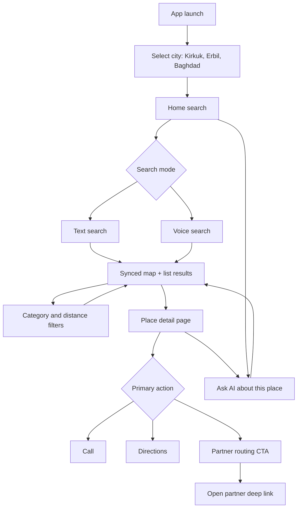
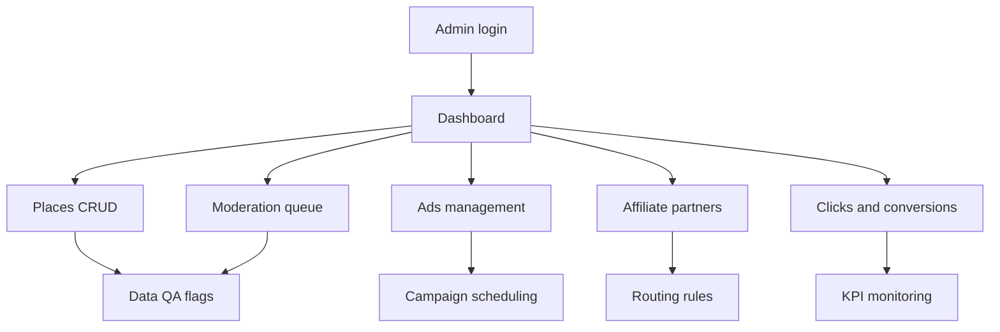
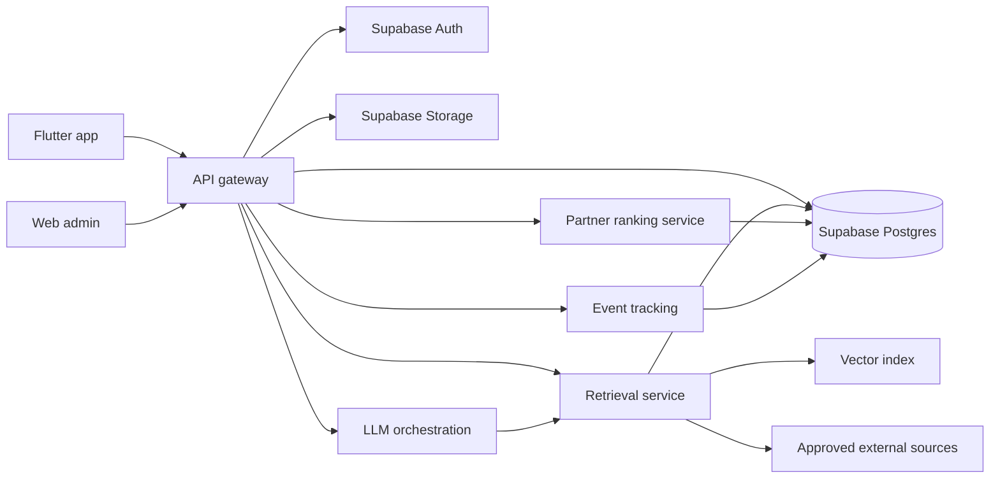

# Iraq.ai App Map

This app map turns the Phase 1 scope into parallel build tracks so the MVP can move from planning to implementation quickly.

## 1) User-Facing Mobile App Map

### Core screens
- **Launch / city selection:** lets users start in Kirkuk, Erbil, or Baghdad.
- **Home search:** supports typed and voice questions in Arabic, Kurdish, and English.
- **Map + list results:** keeps map pins and place cards synchronized.
- **Place detail:** shows description, images, hours, rating, phone, directions, verification status, and source.
- **AI chat:** answers city-aware questions using curated place data first.
- **Partner routing:** opens the highest-ranked active partner link and logs the click.

## 2) Admin Panel Map

### Admin priorities
- Place CRUD and moderation ship first because map/search quality depends on trusted data.
- Affiliate partners and routing rules ship after place details and CTAs are stable.
- Ads and analytics ship last in the MVP sequence.

## 3) Backend Service Map

### Service ownership
- **API gateway:** one stable interface for mobile and admin clients.
- **Retrieval service:** queries internal place data before vector or external enrichment.
- **LLM orchestration:** formats multilingual answers with confidence and source labels.
- **Partner ranking:** applies the weighted satisfaction/commission score.
- **Event tracking:** records routing clicks, search events, and admin audit events.

## 4) Parallel 10-Minute Execution Plan

Use this split when multiple developers or agents work in parallel:

| Track | Owner | Output | Depends on |
| --- | --- | --- | --- |
| Data/schema | Backend | Supabase tables for cities, categories, places, partners, routing events, ads, QA flags | None |
| Mobile shell | Flutter | City selection, home search, placeholder map/list/detail routes | Data contracts |
| Admin shell | Web | Dashboard navigation and place CRUD wireframes | Data contracts |
| Retrieval | Backend/AI | Internal DB search contract and confidence payload | Data/schema |
| Routing | Backend | Partner scoring function and click logging endpoint | Data/schema |
| QA | Product/Ops | Verification checklist and seed data acceptance rules | Data/schema |

### Fast-path order
1. Freeze the data contracts for `cities`, `categories`, `places`, and `partners`.
2. Build mobile routes with mocked data while backend tables are created.
3. Build admin place CRUD against Supabase as soon as tables are available.
4. Connect map/list results to `places.lat` and `places.lng`.
5. Add AI retrieval and partner routing only after place data quality is acceptable.

## 5) MVP Completion Checklist

- [ ] Users can pick a city and language.
- [ ] Users can search by text and see synced map/list results.
- [ ] Users can open a place detail page with call and directions actions.
- [ ] Admins can create, update, verify, and flag places.
- [ ] Backend stores place coordinates, media, partners, ads, routing events, and QA flags.
- [ ] AI answers use internal place records first and return a confidence score.
- [ ] Partner CTA applies the weighted routing formula and logs every click.
